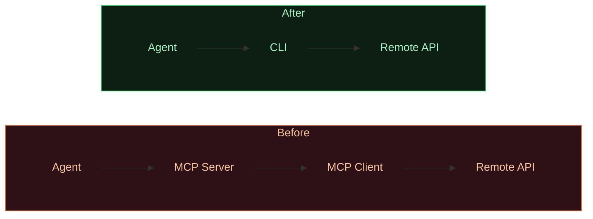
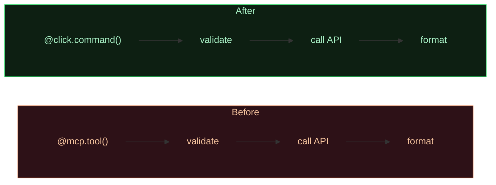

<p align="center">
  <br />
  <picture>
    <source media="(prefers-color-scheme: dark)" srcset="https://img.shields.io/badge/mcp2cli-F7F7F7?style=for-the-badge&labelColor=000&logo=data:image/svg+xml;base64,PHN2ZyB4bWxucz0iaHR0cDovL3d3dy53My5vcmcvMjAwMC9zdmciIHdpZHRoPSIyNCIgaGVpZ2h0PSIyNCIgdmlld0JveD0iMCAwIDI0IDI0IiBmaWxsPSJub25lIiBzdHJva2U9IiNmN2Y3ZjciIHN0cm9rZS13aWR0aD0iMiI+PHBhdGggZD0iTTkgM0g1YTIgMiAwIDAgMC0yIDJ2NGEyIDIgMCAwIDAgMiAyaDRhMiAyIDAgMCAwIDItMlY1YTIgMiAwIDAgMC0yLTJ6Ii8+PHBhdGggZD0iTTMgMTNoMTgiLz48cGF0aCBkPSJNMyAxN2gxOCIvPjxwYXRoIGQ9Ik0zIDIxaDE4Ii8+PHBhdGggZD0iTTE1IDNIN3YxOCIvPjwvc3ZnPg==&logoColor=F7F7F7" />
    
  </picture>
  <br />
  <strong>MCP servers are expensive. CLIs are not.</strong>
  <br />
  <sub>A Claude Code plugin that converts MCP servers into token-efficient CLI tools.</sub>
  <br />
  <br />
  <a href="#-quick-start"></a>
  <a href="#-how-it-works"></a>
  <a href="#-commands"></a>
  <a href="https://github.com/mason/mcp2cli/blob/main/LICENSE"></a>
</p>

---

## Why?

MCP servers load **every tool schema** into the agent's context window on startup. For a server with 30 tools, that's ~55,000 tokens burned before the agent does anything.

A CLI tool with a SKILL.md loads **on-demand** — only when relevant — and returns compact text instead of verbose JSON.

|  | MCP | CLI + Skill |
|:---|:---|:---|
| **Startup** | Load all tool schemas into context | Nothing loaded |
| **Token cost** | ~55,000 tokens for 30 tools | 0 tokens until first use |
| **On use** | JSON + metadata per call | Load SKILL.md once (~2K tokens) |
| **Output** | Verbose structured JSON | Compact plain text |

> **Bottom line:** 94–96% token savings across all scales.

|  | MCP | CLI + Skill | Savings |
|:---|---:|---:|---:|
| 5 tools | 8,000 tok | 500 tok | **94%** |
| 30 tools | 55,000 tok | 2,000 tok | **96%** |
| 100 tools | 134,000 tok | 5,000 tok | **96%** |

> The canonical example: **Playwright** shipped a CLI + SKILL.md alongside their MCP server — specifically for coding agents where token efficiency matters.

---

## Quick Start

**Install the plugin:**

```bash
/plugin install mcp2cli
```

**Or load locally for development:**

```bash
claude --plugin-dir ./path/to/mcp2cli
```

**Convert your first MCP server:**

```
/convert ./my-mcp-server
```

That's it. The plugin analyzes the server, generates CLI code, and creates a SKILL.md — all in one step.

---

## How It Works

The plugin runs a **5-phase conversion pipeline**:


### Phase by Phase

| # | Phase | What happens | Output |
|:-:|:------|:-------------|:-------|
| 1 | **Analyze** | Read MCP source, extract every tool definition, params, outputs, auth requirements | Structured analysis table |
| 2 | **Design** | Map tool names → CLI commands, required params → positional args, optional → flags | Command structure spec |
| 3 | **Generate** | Write CLI code reusing the MCP server's business logic. Zero MCP SDK dependency | Working CLI tool |
| 4 | **Skill** | Generate a SKILL.md under 500 lines with examples for every command | SKILL.md file |
| 5 | **Validate** | Run each CLI command, compare with original MCP output, verify SKILL.md accuracy | Test report |

### Conversion Patterns

The plugin recognizes and handles 4 common MCP architectures:

| Pattern | Description | Complexity |
|:--------|:------------|:----------:|
| **Proxy** | Relays requests to a remote API via MCP protocol | Low |
| **SDK Wrapper** | Wraps an external API with validation & file handling | Medium |
| **Multi-tool** | 10+ tools organized by domain prefixes | Medium |
| **Stateful** | Maintains session state or uses subscriptions | High |

<details>
<summary><b>How each pattern maps to CLI</b></summary>

<br />

**Proxy MCP** — Remove the protocol layer entirely, call the API directly:



**SDK Wrapper** — Keep all business logic, swap only the interface layer:



**Multi-tool** — Group by domain prefix into subcommands:

| MCP Tool Name | CLI Command |
|:---|:---|
| `lol_get_profile` | `mycli lol profile` |
| `lol_get_matches` | `mycli lol matches` |
| `tft_meta_decks` | `mycli tft meta` |
| `val_list_agents` | `mycli val agents` |

**Stateful** — Partial conversion. Stateless reads become CLI, stateful ops stay MCP:

| Operation | Target |
|:---|:---|
| `get_status`, `list_items`, `export_data` | **CLI** |
| `subscribe_updates`, `maintain_session` | **Keep MCP** |

</details>

---

## Commands

### `/convert <path>`

Full end-to-end conversion. Runs all 5 phases.

```
/convert ./my-mcp-server
/convert https://github.com/user/their-mcp-server
```

### `/analyze-mcp <path>`

Analysis only — no code generation. Use this to assess feasibility before committing.

```
/analyze-mcp ./my-mcp-server
```

Returns a table of tools, parameters, recommended CLI mapping, and conversion complexity.

### `/generate-skill <cli-name>`

Generate a SKILL.md for a CLI tool that already exists. Discovers commands via `--help`.

```
/generate-skill my-existing-cli
```

---

## What's Inside

```
mcp2cli/
├── .claude-plugin/
│   └── plugin.json                  # Plugin manifest
│
├── skills/
│   └── mcp2cli/
│       ├── SKILL.md                 # Core conversion skill (auto-invoked)
│       └── references/
│           ├── patterns.md          # 4 conversion patterns + code templates
│           └── skill-template.md    # SKILL.md generation template
│
├── commands/
│   ├── convert.md                   # /convert — full conversion
│   ├── analyze-mcp.md              # /analyze-mcp — analysis only
│   └── generate-skill.md           # /generate-skill — SKILL.md for existing CLI
│
└── agents/
    └── mcp-analyzer.md             # Subagent for MCP source analysis
```

| Component | Count | Purpose |
|:----------|:-----:|:--------|
| Skills | 1 | Auto-invoked conversion engine with reference docs |
| Commands | 3 | `/convert`, `/analyze-mcp`, `/generate-skill` |
| Agents | 1 | MCP server source code analysis |
| Reference docs | 2 | Conversion patterns + SKILL.md template |

---

## When to Convert (and When Not To)

| Convert to CLI | Keep as MCP |
|:---------------|:------------|
| Stateless request/response tools | Real-time streaming / subscriptions |
| Text or JSON output | Binary streams (audio, video) |
| Infrequently used tools (schema overhead > value) | Bidirectional communication |
| Simpler deployment desired | Complex state management across calls |

> **Rule of thumb:** If the MCP tool is basically `input → API call → output`, it should be a CLI.

---

## Contributing

1. **Add patterns** — New conversion patterns go in `skills/mcp2cli/references/patterns.md`
2. **Keep it lean** — SKILL.md stays under 500 lines. Detailed docs go in `references/`
3. **Test conversions** — Point `/convert` at any MCP server and verify the output works

```bash
# Test locally
claude --plugin-dir ./mcp2cli
```

---

## Background & References

This plugin is informed by the emerging pattern of MCP → CLI migration in the agent tooling ecosystem:

- [Playwright CLI + SKILL.md](https://www.npmjs.com/package/@playwright/cli) — The canonical MCP-to-CLI migration
- [mcp-cli](https://www.philschmid.de/mcp-cli) — Dynamic tool discovery bridge (99% token reduction)
- [MCP vs CLI Benchmarks](https://mariozechner.at/posts/2025-08-15-mcp-vs-cli/) — 33% token efficiency advantage for CLI
- [Cloudflare Code Mode](https://blog.cloudflare.com/code-mode-mcp/) — 99.9% token reduction via single-tool MCP
- [Claude Code Skills Docs](https://code.claude.com/docs/en/skills) — Official skill authoring guide
- [Claude Code Plugins Docs](https://code.claude.com/docs/en/plugins) — Official plugin development guide

---

<p align="center">
  <sub>Made for developers migrating from MCP to CLI.</sub>
  <br />
  <sub>Built with <a href="https://claude.com/claude-code">Claude Code</a>.</sub>
</p>
